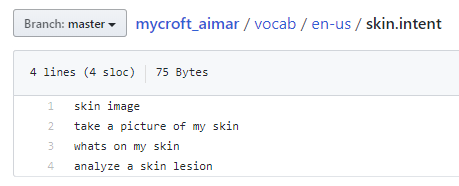
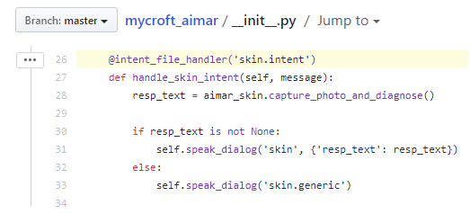
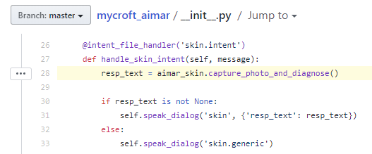
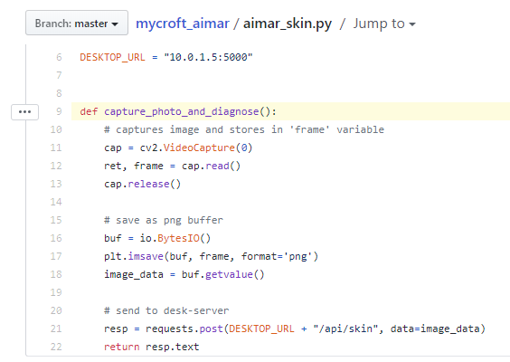
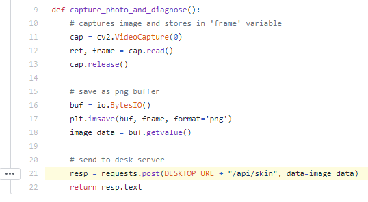
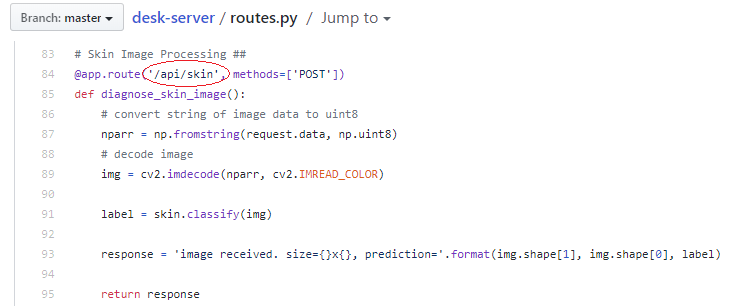
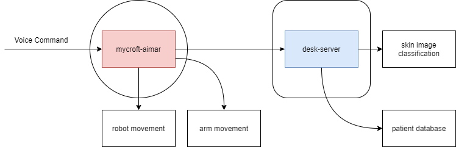

## Files

This repository is a Mycroft "Skill". It is loaded when Mycroft starts up.

Here are the important files to know:

    .
    ├── dialog/en-us            # Mycroft dialog response data
    ├── vocab/en-us             # Mycroft voice command data
    ├── __init__.py             # Central file for managing voice commands
    ├── aimar_arm.py            # uArm control code
    ├── aimar_move.py           # TurtleBot movement code
    ├── aimar_skin.py           # Skin diagnosis code
    └── aimar_patient.py        # Patient database code

## TLDR (What do I work on?)

Read the [Files](#files) section.

**Linguini**
- Voice commands
    - See `__init__.py`, `vocab/..`, and `dialog/..`
    - Read the [Mycroft Intent Tutorial](https://mycroft-ai.gitbook.io/docs/skill-development/intents/padatious-intents)
- Patient database
    - See `aimar_patient.py` and [desk_server](https://github.com/UMD-AIMAR/desk-server)
    - Look up Python **sqlite3** tutorials. (e.g. [docs.python.org](https://docs.python.org/3/library/sqlite3.html))
- User Interface
    - [Set up Mycroft](https://mycroft.ai/get-started/) on your personal machine.
    - [Mycroft GUI Blog Post](https://mycroft.ai/blog/the-mycroft-gui-the-screen-is-dead-long-live-the-screen/), 
    [Github](https://github.com/mycroftai/mycroft-gui/tree/master/documentation)

**Robo** 
- Arm movements
    - See `aimar_arm.py`
    - Google stuff
- Robot movements
    - See `aimar_move.py`
    - Read TurtleBot3 manual and [ROS tutorials](http://wiki.ros.org/turtlesim/Tutorials)

## Code Workflow

Consider an existing command: "AIMAR, what's on my skin?"

1. Detect "what's on my skin" as a voice command. 
    - `vocab/en-us/skin.intent` contains a list of phrases.
    

    - `@intent_file_handler('skin.intent')` means any one of those phrases will trigger the function below: `handle_skin_intent(...)`. 
     

2. Run the skin diagnosis function.
    - `aimar_skin.capture_photo_and_diagnose()` **means**: "inside the script `aimar_skin.py`, run the function `capture_photo_and_diagnose()`".
     
    
    - `capture_photo_and_diagnose()` captures a photo and sends it to desk-server - more about this in step 3.
    

3. Trigger skin diagnosis on the central server.
    - `requests.post(...)` sends a **web request** to a specified address.
     

    - We are running [desk-server](https://github.com/UMD-AIMAR/desk-server/blob/master/routes.py#L84) on our central computer. There is an endpoint that receives requests to `/api/skin`. This is where we do the actual diagnosis, which gets passed back to the robot.
    

## Why is everything in a different file?

Specifically, you're asking why `__init__.py` doesn't contain any of the "actual" code for uArm movement, skin diagnosis, etc. - seems unnecessarily complicated.

The purpose is to separate **different code** into [different files](#files). See how `__init__.py` **only** manages different voice commands (e.g. ["arm test"](https://github.com/UMD-AIMAR/mycroft_aimar/blob/master/__init__.py#L24)
 triggers `test()` inside `aimar_arm.py`. 

This lets Linguini and Robo people work on different files. Also, the system is modular e.g. someone who's working on voice commands doesn't need to know how the arm is being moved.

## Integration Diagram
AIMAR's workflow uses two repositories in [UMD-AIMAR](https://github.com/UMD-AIMAR): 
[mycroft-aimar](https://github.com/UMD-AIMAR/mycroft-aimar) (this repo), 
[desk-server](https://github.com/UMD-AIMAR/desk-server).

## desk-server?
In theory, we have several AIMAR bots communicating with one central computer. 
`desk-server` runs on this computer; it manages the patient database and skin diagnosis functions.

How do voice commands trigger those functions? Read [Code Workflow](#code-workflow).

## Setup
Windows: Download [Git](https://gitforwindows.org/), then open Git Bash.

Mac: Open a terminal.

Run `git clone https://github.com/UMD-AIMAR/mycroft_aimar.git`

Download [uArm-Python-SDK](https://github.com/uArm-Developer/uArm-Python-SDK): `git clone https://github.com/uArm-Developer/uArm-Python-SDK.git`

Copy 'uArm-Python-SDK/uarm' folder into 'mycroft-aimar' folder
